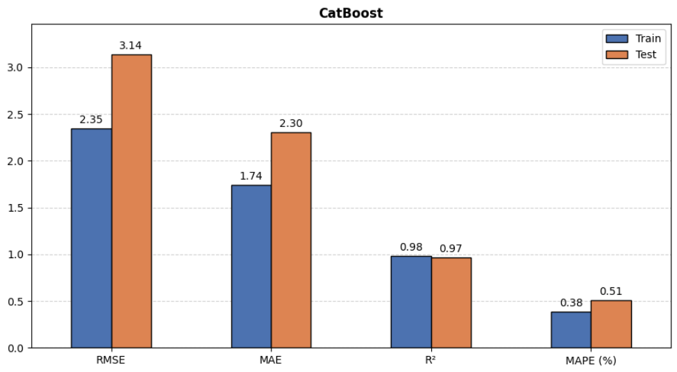
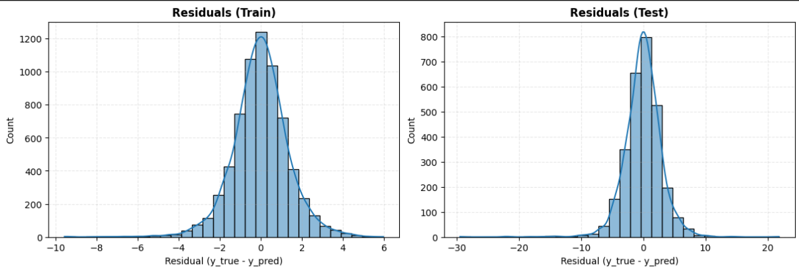
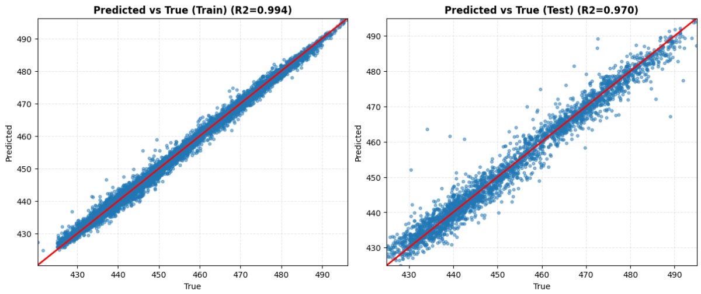

# Combined Cycle Power Plant (CCPP) Energy Prediction

## Project Overview
The objective of this project is to develop a machine learning model to predict the net hourly electrical energy output (PE, in MW) of a Combined Cycle Power Plant (CCPP) operating at full load. The prediction is based on ambient environmental data collected from sensors over a $6$-year period.

## How a Combined Cycle Power Plant (CCPP) Works
A combined cycle power plant is a highly efficient method of electricity generation that integrates both gas and steam turbines:

* **Compressor:** Ambient air (`AT`, `AP`, `RH`) enters the compressor, where it is compressed to high pressure.
* **Combustion Chamber:** From the compressor, the air is directed into the combustion chamber, where fuel is injected, and its combustion produces high-temperature, high-pressure gases.
* **Gas Turbine:** The flow of hot gases spins the gas turbine, generating the primary portion of the electricity.
* **Heat Recovery Steam Generator (HRSG):** After this, part of the energy is lost in the form of exhaust hot gases, but instead of being released into the atmosphere, they enter the HRSG, where they heat water and turn it into steam.
* **Steam Turbine:** This steam drives a secondary turbine, generating additional energy.
* **Condenser:** The steam is then cooled in the condenser (exhaust vacuum `V`), turns back into water, and returns to the boiler, completing a closed loop.
* **Total Power Output (PE):** The total net electricity output generated by both turbines, which depends on how ambient weather conditions affect the entire cycle.

## Dataset
The dataset contains $9,568$ hourly average observations of the following physical parameters:
* **AT:** Ambient Temperature (°C)
* **V:** Exhaust Vacuum (cm Hg)
* **AP:** Ambient Pressure (mbar)
* **RH:** Relative Humidity (%)
* **PE:** Net hourly electrical energy output (Target Variable, MW)

## Tech Stack
* **Data Processing & Mathematics:** `NumPy`, `Pandas`, `SciPy`, `math`
* **Visualization:** `Matplotlib`, `Seaborn`
* **Machine Learning:** `Scikit-Learn`
* **Advanced Ensembles:** `XGBoost`, `CatBoost`
* **Deep Learning:** `TensorFlow` / `Keras`, `SciKeras`

## Repository Structure
* `01_power_plant_analysis.ipynb`: Exploratory Data Analysis (EDA). Includes distribution checks, correlation analysis, and pairwise relationship studies.
* `02_Modeling_and_Evaluation_power_plant.ipynb`: Model training, hyperparameter tuning (`GridSearchCV`), and performance evaluation.
* `utils.py`: Auxiliary script containing custom functions for visualization and metric calculations.

## Key Findings & Results
* **Feature Engineering:** The raw physical features naturally describe the process patterns. Additional transformations (other than scaling) did not yield any significant improvements in model quality.
* **Model Performance:** Tree-based ensemble models (`CatBoost`, `XGBoost`) demonstrated the best results compared to baseline linear algorithms.

* **Super Learner:** A stacking ensemble (comprising `CatBoost`, `XGBoost`, `Random Forest`, `SVR`) provided an industrial-grade level of precision: $R^2$ of approximately $0.971$ and an $RMSE$ of approximately $2.91$ on the test set.
* **Error (Residual) Analysis:** The distribution of the model's residuals is symmetric and centered around zero, proving the absence of systematic bias.

* **Predicted vs True:** Errors are purely random, and the plot comparing predicted vs. true values maintains a strict diagonal structure with no skewness, confirming the stability of the model on new data.

## Conclusion
Given clean data from physical sensors, machine learning models are capable of precisely reproducing complex thermodynamic dependencies without the need for complex feature engineering.
